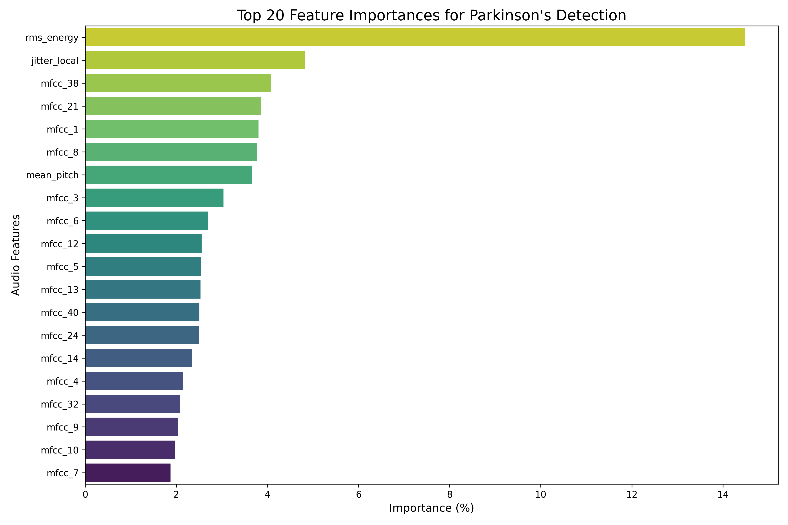

# 🧠 Parkinson-Prediction

[](https://www.python.org/)
[](https://opensource.org/licenses/MIT)
[](https://github.com/Karan-S1ngh/Parkinson-Prediction/stargazers)
[](https://github.com/Karan-S1ngh/Parkinson-Prediction/commits/main)

**A non-invasive machine learning pipeline for early detection of Parkinson's Disease using sustained vowel speech analysis.**

This project aggregates heterogeneous speech datasets, extracts advanced acoustic features (40 MFCCs, jitter, RMS energy, etc.), trains ensemble models (CatBoost, XGBoost, etc.), and provides a user-friendly **Streamlit web application** for real-time predictions from uploaded audio files.

## ✨ Key Features

* Aggregates ~1,571 sustained vowel recordings from PC-GITA and multi-modal datasets
* Extracts 46 acoustic features (Librosa + Parselmouth)
* Achieves **91.2% weighted F1-score** with CatBoost on heterogeneous data
* Interpretable results: RMS energy and jitter are top predictors
* Deployable **Streamlit web app** for telehealth screening
* Fully reproducible with detailed Jupyter notebooks and scripts

## 📑 Table of Contents

* [Project Overview](#project-overview)
* [Demo](#demo)
* [Dataset](#dataset)
* [Installation](#installation)
* [Usage](#usage)
* [Pipeline Architecture](#pipeline-architecture)
* [Results](#results)
* [Feature Importance](#feature-importance)
* [Web Application](#web-application)
* [Future Work](#future-work)
* [Contributing](#contributing)

## 📌 Project Overview

This repository implements an end-to-end machine learning pipeline for Parkinson's Disease (PD) detection from speech, specifically sustained vowel phonations. The system is designed for **telehealth applications** and addresses key gaps in existing research: lack of multi-source data handling and lack of deployable tools.

The pipeline achieves **91.2% weighted F1-score** across heterogeneous datasets and includes a production-ready Streamlit app for real-time analysis of uploaded audio.

## 🎥 Demo

Try the live demo:
🔗 **[Parkinson Prediction App](https://parkinson-diease-prediction.streamlit.app/)** 

OR run locally:

```bash
streamlit run app.py
```

## 🗂 Dataset

Aggregated from public sources (~1,571 samples):

* **PC-GITA** (Colombian Spanish vowels)
* **Parkinson Multi-Modal Dataset v2.0** (Kaggle)
* Supplementary raw vowel recordings

All recordings are sustained vowels (A, E, I, O, U) to capture PD-specific dysphonia.

## ⚙️ Installation

### Prerequisites

* Python 3.12+
* Git

### Clone the Repository

```bash
git clone https://github.com/Karan-S1ngh/Parkinson-Prediction.git
cd Parkinson-Prediction
```

### Install Dependencies

```bash
pip install -r requirements.txt
```

### Install Additional Audio Libraries (if needed)

```bash
pip install librosa parselmouth
```

> **Note**: On macOS/Linux, you may need `ffmpeg` and `portaudio` for audio processing.

---

## Usage

### 1. Reproduce Feature Extraction

```bash
python extract_features_40.py
```

Generates `features_dataset_40mfcc.csv`.

### 2. Train & Evaluate Models

```bash
python train_models.py
```

Best model saved to `model_assets/best_model.joblib`.

### 3. Visualize Feature Importance

```bash
python visualize_features.py
```

Saves `feature_importance_plot_percentage.png`.

### 4. Run the Web Application

```bash
streamlit run app.py
```

Upload a `.wav` or `.mp3` file of sustained vowel phonation → get prediction instantly.

---

## 🏗 Pipeline Architecture

Raw Audio Datasets (PC-GITA, Multi-modal Sources)
        ↓
Data Aggregation
→ master_labels.csv
   (audio_common.py)
        ↓
Feature Extraction
→ features_dataset_40mfcc.csv
   (extract_features_40.py)
        ↓
Exploratory Data Analysis (EDA)
→ Statistical summaries & visualizations
   (eda.py)
        ↓
Preprocessing
→ Feature scaling & median imputation
   (train_models.py)
        ↓
Model Training & Evaluation
→ 10 machine learning classifiers
        ↓
Best Model Selection
→ CatBoost + serialized assets
   (model_assets/)
        ↓
Deployment
→ Streamlit Web Application
   (app.py)


## 📊 Results

| Model         | Accuracy | Precision (PD) | Recall (PD) | F1-Score (weighted) |
| ------------- | -------- | -------------- | ----------- | ------------------- |
| CatBoost      | 91.0%    | 92.1%          | 90.3%       | 91.2%               |
| XGBoost       | 90.4%    | 91.5%          | 89.8%       | 90.6%               |
| Random Forest | 88.1%    | 89.0%          | 87.5%       | 88.3%               |
| SVM           | 85.3%    | 86.5%          | 84.2%       | 85.4%               |


## 🔍 Feature Importance

Top features (CatBoost):

1. rms_energy – 13.4%
2. jitter_local – 6.2%
3. mfcc_21 – 5.1%
4. mfcc_38 – 4.8%
5. mfcc_1 – 4.5%




## 🌐 Web Application

The Streamlit app provides:

* File upload (`.wav`, `.mp3`)
* Real-time feature extraction
* Prediction + confidence score
* Visualized extracted features


## 🔮 Future Work

* Multi-lingual support (more languages/accents)
* Real-world noise robustness (data augmentation)
* Integration with mobile apps
* Longitudinal severity prediction (UPDRS regression)
* Clinical validation trials


## 🤝 Contributing

Contributions are welcome!
Please feel free to open issues or submit pull requests.


## 📜 License

This project is licensed under the MIT License 

## 🙏 Acknowledgments

* Datasets: PC-GITA, Kaggle Parkinson Multi-Modal Dataset
* Libraries: Librosa, Parselmouth, scikit-learn, XGBoost, CatBoost, Streamlit
* Inspiration: Research on PD speech analysis (Little et al., Orozco-Arroyave et al.)


